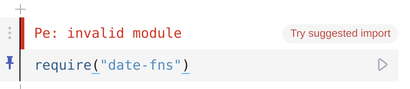

# ObservableHQ Require Helper

This extension will offer you suggested ways to import packages.

At the moment the suggestions are pulled from this github repo in *lookup.json*
although also have plans for adding a way to open quickly in module require debugger.